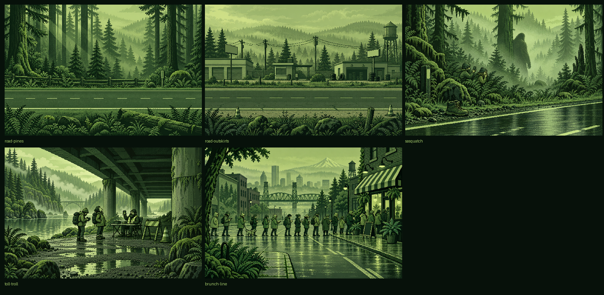

# Five-scene artwork validation

October 2, 2026. Local work on `codex/scene-art-v4`; no push or deployment. The [v4 brief](../art/2026-10-02-scene-brief-v4.md) supplies the scene design. The [master index](../handoff/graphics-v4/README.md) and [exact prompt/provenance set](../handoff/graphics-v4/generation.json) identify all five immutable PNGs.

## Generation and preservation

- Built-in `image_gen`, five initial generations plus one targeted Sasquatch refinement. The first figure read too clearly as an ape; the selected refinement hides its face and uses a shaggy human-shaped silhouette in crisp dithered fog.
- Each initial prompt includes the unchanged shared style and exclusion blocks, expanded completely. Composition guidance places encounter interactions near the center to survive the existing crops.
- Five opaque RGB PNG masters, exactly 1536×1024. SHA-256 confirms each workspace master is an unchanged copy of its selected output. No existing artwork was modified.
- All five pass the brief's eight-color representative palette check: green is the largest RGB channel in every representative color. They use green shades and dithering; this does not mean every pixel equals one of the four prompt hex values.
- Native images inspected for pixel edges and silhouettes, wordless gags, blank signs/screens, and absence of vehicles/people in roads or a van in encounters.

## Integration

`prepare-assets.py` sources the five v4 masters with crop `None`. `data.js` changes only the scene references for regions `pines` and `outskirts` and encounters `sasquatch`, `toll_troll`, and `brunch_line`. A deep comparison confirms all other exported data is unchanged; no gameplay numbers, choices, encounter weights, saves, or engine code changed.

`npm run assets` passed: 64 scene WebPs (32 full/phone pairs), exactly 10 new scene files, and a manifest with 82 assets. Existing scene exports, sprites, icons, and font output remain unchanged. Masters feed 1536×1024 and 960×640 WebPs through the existing pipeline.

## Browser evidence

Headless installed Chrome checked each scene at 390×664, 414×715, 430×739, 1440×900, and 844×390: 25 cases, 230 checks, zero failures. Final fixtures load the two regions at miles 400/800, Sasquatch at mile 400, toll troll at mile 300, and brunch line at mile 900, inside each encounter's route range. The focused harness was rerun after correcting the toll/brunch fixture miles; final evidence below reflects that rerun. These are controlled visual fixtures, not claims that each encounter appeared randomly during a physical playthrough.

Checks cover responsive scene ids, decoded images, JavaScript/response errors, horizontal overflow, phone control and editable-text sizes, road van containment, visible encounter choices, and keyboard focus. All five crop sheets and full-screen sheets were visually inspected. No blocking crop or legibility defect was found.

| Scene | Preserved crop evidence |
| --- | --- |
| Dense pines | [All five sizes](scene-art-v4/road-pines-crops.png) |
| Town outskirts | [All five sizes](scene-art-v4/road-outskirts-crops.png) |
| Sasquatch | [All five sizes](scene-art-v4/sasquatch-crops.png) |
| Toll collector | [All five sizes](scene-art-v4/toll-troll-crops.png) |
| Brunch queue | [All five sizes](scene-art-v4/brunch-line-crops.png) |

Desktop and portrait encounter images crop vertically; short landscape images crop the sides. In landscape, brunch loses most restaurant frontage but preserves the queue crossing the road. Sasquatch retains the figure and phone travelers; toll retains the collector, card reader, table, and travelers. Road art was inspected through the existing crop positions, zoom, foreground road, and van layers. No general layout changes were needed.

## Regression checks

| Command | Result |
| --- | --- |
| `npm test` | 211 tests passed, zero failed; includes fuzz and balance checks. |
| `npm run typecheck` | Passed. |
| `npm run test:browser` | Six suites, 835 checks, zero failed; build passed. |
| Browser journeys | Successful and losing routes passed, including a win with fallen travelers. |
| Browser offline | 30 checks passed, including offline art and worker upgrade. |
| Focused artwork harness | 25 cases / 230 checks / zero failed. |

[checks.json](scene-art-v4/checks.json) preserves the focused measurements, palette analysis, and browser-suite results. The temporary harness and all 50 individual screenshots are under the ignored `app/test-results/scene-art-v4/` and `.superpowers/sdd/2026-10-02-scene-art-v4/`; the gallery and crop sheets above are retained in this validation folder. Browser/server resources were closed after verification.

The [independent final review](scene-art-v4/review.md) passed spec compliance and visual quality with no open findings. A separate source comparison verifies that only the five scene values changed in the data exports. Every provenance prompt retains the full shared style and exclusion blocks verbatim, and all 82 asset/source hash pairs match the manifest. Both project checksum manifests are refreshed and checked before the task-owned commit.

Verification uses browser emulation only. No real-device browser was tested. The generated palette is controlled green shading, not an exact indexed four-color export.
