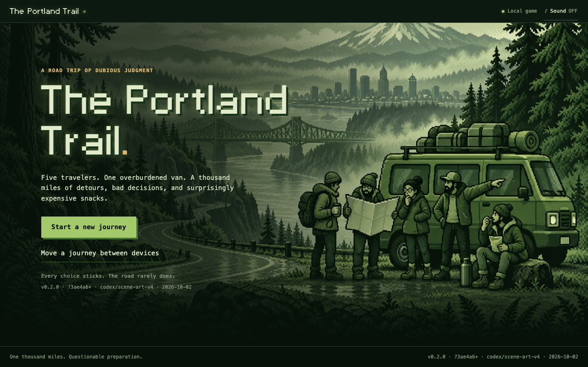
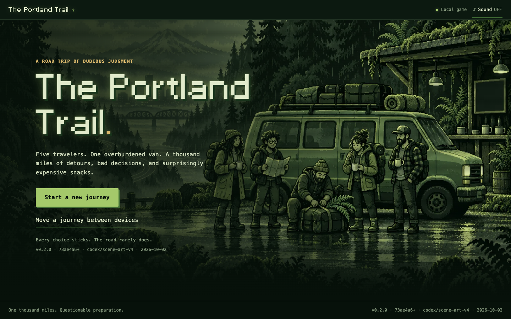
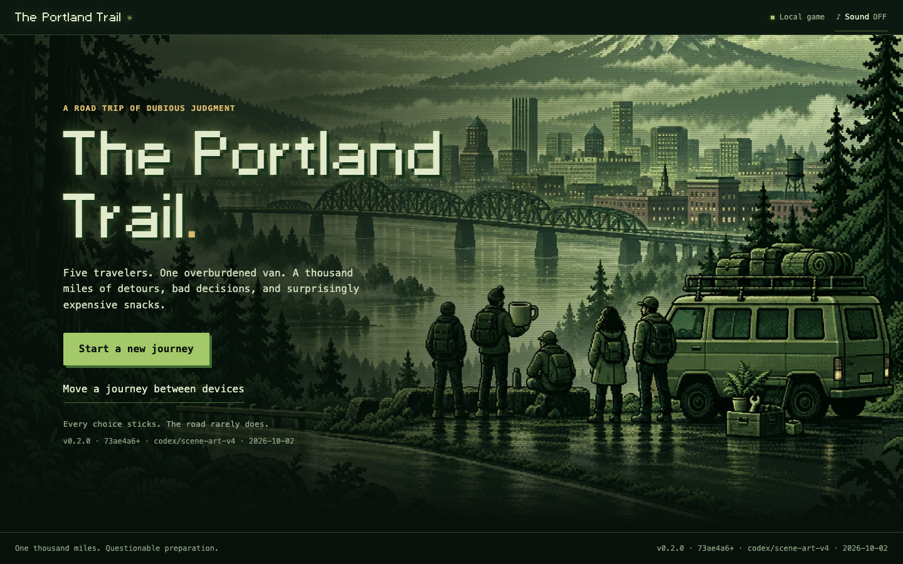

# Three splash alternatives

The user selected **1. The Road Ahead**. All [source masters](../../handoff/graphics-v5/README.md) remain preserved with their [exact prompts](../../handoff/graphics-v5/generation.json). These previews keep the existing game title and controls; the image generation contains no lettering or buttons.

## 1. The Road Ahead — selected

The winding road, five travelers, overloaded van and distant Portland show the promise of the whole journey.

[Phone preview](title-road-ahead-390x844.png) · [Integrated desktop](selected-title-1440x900.png) · [Integrated phone](selected-title-390x844.png) · [Original PNG](../../handoff/graphics-v5/title-road-ahead.png)

## 2. The Departure Crew

Closer character staging at a mossy coffee shelter, with a fern escaping the packed luggage.

[Phone preview](title-five-travelers-390x844.png) · [Original PNG](../../handoff/graphics-v5/title-five-travelers.png)

## 3. Portland Beckons

A broad destination panorama, with the crew, van and an oversized coffee mug overlooking the city.

[Phone preview](title-portland-beckons-390x844.png) · [Original PNG](../../handoff/graphics-v5/title-portland-beckons.png)

## Evidence

[Candidate report](report.json): 15 cases / 150 checks / zero failed. [Integrated title report](selected-report.json): five cases / 55 checks / zero failed, actual production image bytes without interception. See the [integration record](../2026-10-02-splash-v5.md) for regression checks and viewport limits.
